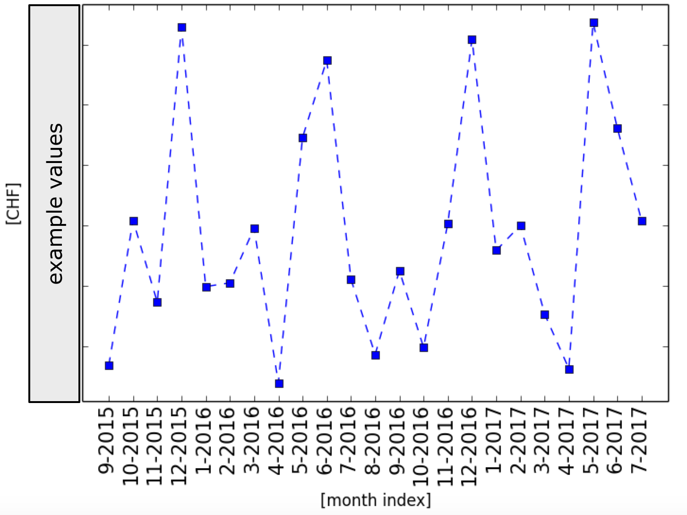

# ubsDriver
Read a CSV file from a UBS bank account statement and perform some example analytics

<h4> Configuration </h4>
Edit the python script to adjust it to you needs. The example given is for calculating the monthly expenses as function of time, excluding optionally some debits or time periods that will be indicated by the user. 
<pre>
<code>
### Initialization
csvFileName = "/tmp/export.csv"   # Put here path+filename to the CSV file
excludeDebits = ['1170.00']       # Put here any reoccurring debits you don't want to consider, e.g., your rent
fd = ""                           # First day DD.MM.YYYY (leave empty to use default from CSV record)
ld = "30.07.2017"                 # Last day DD.MM.YYYY (leave empty to use default from CSV record)
makePlot = True # Create a graphic showing expenses as function of time
</code>
</pre>

